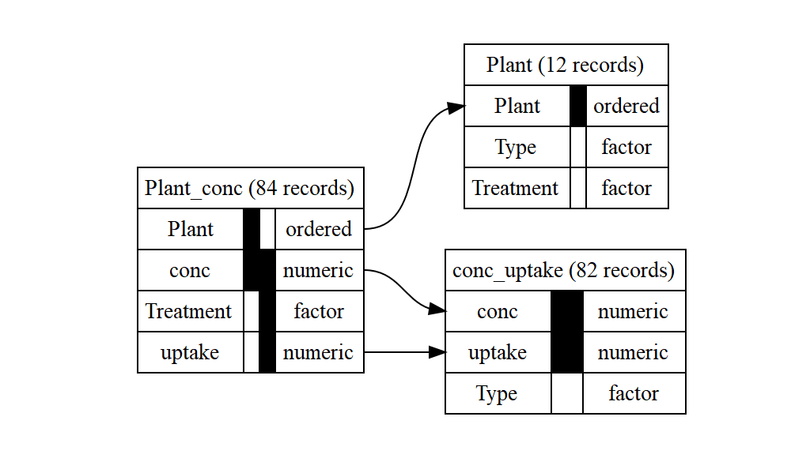

# autodb

autodb is an R package for automatic normalisation of a data frame to
third normal form, with the intention of easing the process of data
cleaning. (Usage to design your actual database for you is not advised.)

## Installation

You can install the development version of autodb from
[GitHub](https://github.com/) with:

``` r
# install.packages("devtools")
devtools::install_github("CharnelMouse/autodb")
```

## Example

Turning a simple data frame into a database:

``` r
library(autodb)
#> 
#> Attaching package: 'autodb'
#> The following object is masked from 'package:stats':
#> 
#>     decompose
summary(ChickWeight)
#>      weight           Time           Chick     Diet   
#>  Min.   : 35.0   Min.   : 0.00   13     : 12   1:220  
#>  1st Qu.: 63.0   1st Qu.: 4.00   9      : 12   2:120  
#>  Median :103.0   Median :10.00   20     : 12   3:120  
#>  Mean   :121.8   Mean   :10.72   10     : 12   4:118  
#>  3rd Qu.:163.8   3rd Qu.:16.00   17     : 12          
#>  Max.   :373.0   Max.   :21.00   19     : 12          
#>                                  (Other):506
db <- autodb(ChickWeight, accuracy = 1, name = "ChickWeight")
db
#> database ChickWeight with 2 relations
#> relation Time_Chick: Time, Chick, weight; 578 records
#>   key 1: Time, Chick
#> relation Chick: Chick, Diet; 50 records
#>   key 1: Chick
#> relationships:
#> Time_Chick.Chick -> Chick.Chick
graphviz_text <- gv(db)
DiagrammeR::grViz(graphviz_text)
```


Using the `exclude_class` argument to forbid numeric variables from
appearing in keys:

``` r
summary(CO2)
#>      Plant             Type         Treatment       conc          uptake     
#>  Qn1    : 7   Quebec     :42   nonchilled:42   Min.   :  95   Min.   : 7.70  
#>  Qn2    : 7   Mississippi:42   chilled   :42   1st Qu.: 175   1st Qu.:17.90  
#>  Qn3    : 7                                    Median : 350   Median :28.30  
#>  Qc1    : 7                                    Mean   : 435   Mean   :27.21  
#>  Qc3    : 7                                    3rd Qu.: 675   3rd Qu.:37.12  
#>  Qc2    : 7                                    Max.   :1000   Max.   :45.50  
#>  (Other):42
db2_noexclude <- autodb(CO2, accuracy = 1, name = "CO2")
db2_noexclude
#> database CO2 with 3 relations
#> relation Plant_conc: Plant, conc, Treatment, uptake; 84 records
#>   key 1: Plant, conc
#>   key 2: Treatment, conc, uptake
#> relation Plant: Plant, Type, Treatment; 12 records
#>   key 1: Plant
#> relation conc_uptake: conc, uptake, Type; 82 records
#>   key 1: conc, uptake
#> relationships:
#> Plant_conc.Plant -> Plant.Plant
#> Plant_conc.conc -> conc_uptake.conc
#> Plant_conc.uptake -> conc_uptake.uptake
db2 <- autodb(CO2, accuracy = 1, name = "CO2", exclude_class = "numeric")
db2
#> database CO2 with 2 relations
#> relation Plant: Plant, Type, Treatment; 12 records
#>   key 1: Plant
#> relation Plant_conc_uptake: Plant, conc, uptake; 84 records
#>   key 1: Plant, conc, uptake
#> relationships:
#> Plant_conc_uptake.Plant -> Plant.Plant
graphviz_text2 <- gv(db2)
DiagrammeR::grViz(graphviz_text2)
```



There are also functions for doing each step of the database creation
separately, including functional dependency detection and normalisation.
See the vignette for more details.
